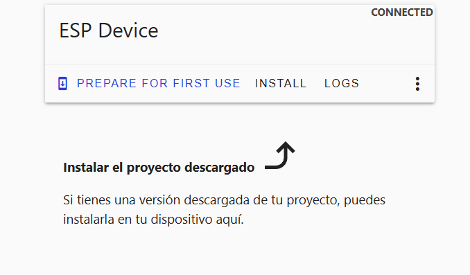
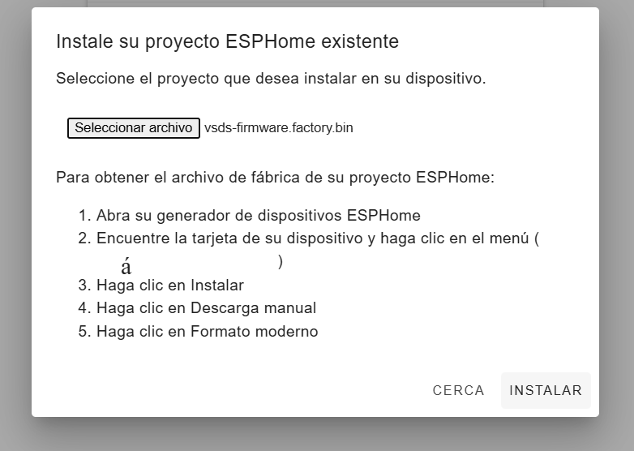

##INSTALACION Y CONFIGURACION DE ESP32
El primer paso a seguir sera conectar nuestra **ESP32** al ordenador con el que vayamos a reconecer el dispositivo con un **cable USB**,
una vez conectado abriremos **Home Assistant en nuestro navegador** , introduciremos nuestro usuario,contraseña y nos iremos a  **ESPHome Builder**.

Una vez alli haremos click donde pone **NEW DEVICE**

Se abrira una ventana donde podremos configurar el nombre de nuestro dispositivo.Cuando lo hayamos introducido pulsamos Next:

Elegimos el dispositivo de la lista (en nuestro caso ESP32) y seguimos los pasos.Cuando terminemos la configuración del dispositivo 
saltará una ventana indicando la clave de encriptación y  pulsamos en Install:

En la siguiente ventana , despues de pulsar install deberemos especificar cómo queremos instalar el archivo .yaml en el dispositivo.
Pulsaremos en la opcion **plug into this computer**

Una vez pulsado nos parecera la siguiente pestaña , donde tendramos que esperar unos minutos a que prepare el archivo .yaml para poder
descargarlo.

Le daremos a **OPEN ESPHOME WEB** y nos llevara a la siguiente pestaña:

Pulsaremos en conectar y seleccionaremos la conexion usb de nuestro ordenador,una ve hecho se nos abrira la siguiente pestaña:

Presionaremos en seleccionar archivo,seleccionaremos el archivo **.yaml** descargado previamente y pulsaremos **instalar**.

switch:
 - platform: gpio
   name: "Relay"
   pin: GPIO19

